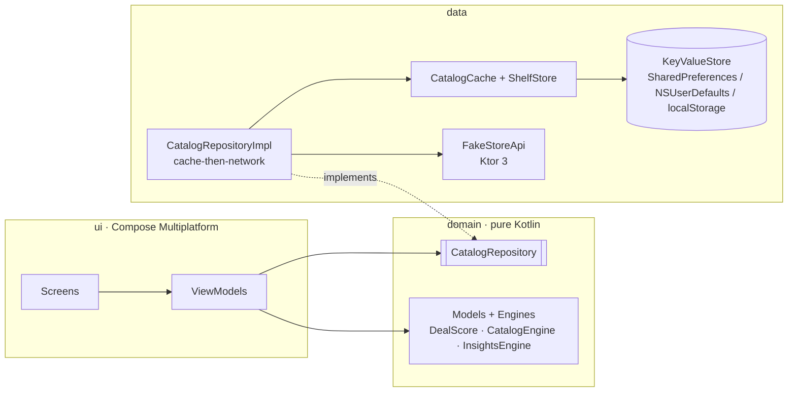

<div align="center">

# 🛍️ Kaleido

### An offline-first product catalog — built once in Kotlin, shipped to Android, iOS & Web.

[](https://github.com/chinmay-tayade/Kaleido/actions/workflows/ci.yml)
[](https://github.com/chinmay-tayade/Kaleido/releases/latest)
[](https://kotlinlang.org)
[](https://www.jetbrains.com/compose-multiplatform/)
[](#-platforms)

**[⬇️ Download the Android APK](https://github.com/chinmay-tayade/Kaleido/releases/latest/download/kaleido-v1.0.0.apk)**  ·  [Releases](https://github.com/chinmay-tayade/Kaleido/releases)  ·  [Architecture](#-architecture)  ·  [Build & run](#-build--run)

<br />

[](https://vercel.com/new/clone?repository-url=https%3A%2F%2Fgithub.com%2Fchinmay-tayade%2FKaleido)

<!-- LIVE_DEMO -->

</div>

---

Kaleido starts from the classic *"Product Catalog"* brief — list the [Fake Store API](https://fakestoreapi.com)
products, open a detail screen — and takes it as far as the data allows: **one Compose
Multiplatform codebase**, a real **offline-first** data layer, and a set of features the
API's `price` / `rating` fields quietly make possible (value scoring, side‑by‑side
compare, category analytics), wrapped in a **quick‑commerce UI** that runs identically on
a phone, a tablet and a desktop browser.

<br />

## 📱 Platforms

| Platform | Entry point | Status |
|---|---|---|
| **Android** | `composeApp/src/androidMain` → `MainActivity` | ✅ **[Download APK](https://github.com/chinmay-tayade/Kaleido/releases/latest/download/kaleido-v1.0.0.apk)** · `minSdk 24` |
| **iOS** | `iosApp/` (SwiftUI shell) + `KaleidoKit.framework` | ✅ framework builds — open `iosApp/iosApp.xcodeproj` in Xcode |
| **Web** | `composeApp/src/wasmJsMain` (Kotlin/Wasm + Skia) | ✅ prebuilt in [`web/`](web/) — [deploy to Vercel](#-deploy-the-web-app) |

> The APK is a debug build signed with the standard Android debug key. Enable
> *Install unknown apps* for your browser or file manager to sideload it.

<br />

## ✨ Features

### Core — from the brief
- **Product list** — adaptive grid, image + title + price, pull‑to‑refresh, infinite
  scroll (the API caps at 20, so paging steps 10 → 20).
- **Product detail** — image, title, price, description, category, rating + "more in this category".
- **Search / filter / sort** — debounced search across title, category and description;
  category tiles; sort by value, price ↑/↓, rating or name.
- **Every state handled** — loading, empty, error + retry. No crashes on a dead network.

### Beyond the brief

| | |
|---|---|
| 🔌 **Offline‑first** | The last good catalog is persisted locally and shown instantly on a cold start. A failed refresh keeps the cached data on screen and flips a visible *"showing your saved copy"* banner instead of erroring. |
| 🛒 **Wishlist · Cart · Compare** | Favourite anything, adjust cart quantities, compare 2–3 products side by side. All on‑device — survives process death and airplane mode, no account, no backend. |
| ⚡ **Quick‑commerce UI** | `ADD` button on every card that morphs into an inline `−  qty  +` stepper; a sticky **View cart** bar; a 2‑row category tile grid; "Deals of the day" rail; pull‑to‑refresh; an *"Added to cart · VIEW CART"* snackbar; a sort bottom sheet; grid items animate on reorder and press. |
| 💎 **Deal Score & "For You"** | An explainable 0–100 value metric per product — rewards a good rating (shrunk toward the mean when reviews are thin) and punishes a high price. Drives the badges, the default sort, and a diverse per‑category "For You" rail. |
| 📊 **Category insights** | Average price & rating, price ranges, a rating histogram and a per‑category "best value" — charts drawn in Compose. |
| 📐 **Responsive scaling** | A cross‑platform `sdp` / `ssp` system (see [below](#-responsive-scaling)) so every dimension and font size scales cleanly from a small phone to a desktop browser. |

<br />

## 🏗 Architecture

**MVVM · unidirectional state · clean‑ish layering.** Every screen exposes a single
`StateFlow<XxxUiState>` from a multiplatform `ViewModel` and renders it with
`collectAsStateWithLifecycle`. The `domain` layer is plain Kotlin — no Compose, no Ktor,
no platform types — and is where the interesting logic lives, which is why it's the part
that's unit‑tested.



<details>
<summary><b>Source tree</b></summary>

```
composeApp/src/commonMain/kotlin/com/kaleido/app/
├─ domain/               pure Kotlin — no Compose / Ktor / platform types
│  ├─ Product.kt              model + dealScore() + synthetic MRP/discount
│  ├─ Catalog.kt              CatalogEngine: filter / sort / "for you"
│  ├─ Insights.kt             InsightsEngine: category aggregates, histograms
│  ├─ Cart.kt                 CartSummary totals
│  └─ CatalogRepository.kt    interface + DataStatus
│
├─ data/
│  ├─ remote/            Ktor client + hand-rolled JSON mapping for the Fake Store API
│  ├─ local/             KeyValueStore (interface) + CatalogCache + ShelfStore
│  └─ CatalogRepositoryImpl.kt   cache-then-network, status tracking
│
├─ di/                   Koin modules (expect/actual platformModule per target)
│
└─ ui/
   ├─ theme/             Kaleido colour system + commerce tokens + Scale.kt (sdp/ssp)
   ├─ components/         ProductCard, AddButton, RatingChip, PriceRow, charts, states
   ├─ catalog/ detail/ store/ compare/ insights/   screen + ViewModel per feature
   └─ nav/               string route table
```

</details>

**Dependency rule:** `ui → domain ← data`. `domain` depends on nothing platform‑specific.
DI is Koin, with an `expect val platformModule` supplying the HTTP engine
(OkHttp / Darwin / JS) and the key‑value store per platform.

<br />

## 📐 Responsive scaling

The Android‑only [`com.intuit.sdp`](https://github.com/intuit/sdp) / `com.intuit.ssp`
libraries are XML‑`dimen` resources — they don't exist for iOS or Web.
[`ui/theme/Scale.kt`](composeApp/src/commonMain/kotlin/com/kaleido/app/ui/theme/Scale.kt)
reimplements the idea for Compose Multiplatform:

1. the window is measured **once** at the root,
2. a single scale factor is derived against a reference phone width and **clamped**,
3. it's exposed so `12.sdp` / `13.ssp` read like the sdp/ssp API but resolve identically
   on phone, tablet and desktop web.

On wide screens the primary content column is also centred and width‑capped, like every
real store's web layout.

<br />

## 🧰 Tech stack

| Area | Choice |
|---|---|
| Language | Kotlin 2.4.10 · coroutines / `Flow` |
| UI | Compose Multiplatform 1.11 (Material 3) · Navigation Compose |
| Networking | Ktor 3 client · `kotlinx.serialization` JSON‑tree parsing |
| DI | Koin 4 |
| Images | Coil 3 (multiplatform, Ktor fetcher) |
| Persistence | platform key‑value stores behind one interface |
| Build | Gradle 9 · AGP 9 · version catalog |
| Tests | `kotlin-test` · `kotlinx-coroutines-test` · Turbine · Ktor `MockEngine` |

<br />

## 🚀 Build & run

```bash
# Android — APK or straight onto a device / emulator
./gradlew :composeApp:assembleDebug
./gradlew :composeApp:installDebug

# Web — static bundle in composeApp/build/dist/wasmJs/productionExecutable
./gradlew :composeApp:wasmJsBrowserDistribution
./gradlew :composeApp:wasmJsBrowserDevelopmentRun     # live dev server on :8080

# iOS — build the shared framework, then open the Xcode project
./gradlew :composeApp:linkDebugFrameworkIosSimulatorArm64
open iosApp/iosApp.xcodeproj      # pick a simulator and Run

# Tests — domain, repository, stores, DI graph (32 tests)
./gradlew :composeApp:testDebugUnitTest
```

> The Fake Store API needs no key. `NSAppTransportSecurity` is relaxed in the iOS
> `Info.plist` because the API is plain HTTP‑friendly.

<br />

## 🌐 Deploy the web app

The Kotlin/Wasm build is **committed prebuilt** to [`web/`](web/), so Vercel serves it
with no build step.

> **Live demo:** _add your `*.vercel.app` URL here after the first deploy_

1. **[vercel.com/new](https://vercel.com/new)** → Import this repo (`chinmay-tayade/Kaleido`)
2. Vercel reads [`vercel.json`](vercel.json) — Output Directory `web`, no build command,
   `.wasm` MIME + cache headers already set. Just click **Deploy**.
3. Every push to `main` redeploys.

Refresh the bundle after changing app code:

```bash
./scripts/build-web.sh      # rebuilds web/ from source
git commit -am "rebuild web" && git push
```

The **`Build web bundle`** GitHub Action ([`.github/workflows/web.yml`](.github/workflows/web.yml))
also does this automatically whenever `composeApp/src/**` changes.

<br />

## 🧪 Tests

`commonTest` covers the parts that carry logic:

- **`DealScoreTest`** — monotonicity (cheaper ⇒ higher, better‑rated ⇒ higher, more reviews ⇒ higher) and bounds
- **`CatalogEngineTest`** — search, category filter, every sort mode, "For You" diversity
- **`CartAndInsightsTest`** — cart totals & smart‑basket savings, category aggregates, histogram coverage
- **`CatalogRepositoryTest`** — warm‑start emits cache before any network call; refresh success ⇒ `Live`; refresh failure keeps cache ⇒ `Offline` (Ktor `MockEngine`)
- **`ProductPricingTest`** — synthetic MRP / discount % is deterministic, in range, and always above the sale price
- **`ShelfStoreTest`** — wishlist / cart / compare persistence round‑trips
- **`DiGraphTest`** — every Koin definition resolves

<br />

## 📝 Notes & trade‑offs

- **`@Serializable` is avoided in shared code** — the kotlinx.serialization compiler
  plugin currently crashes on the Kotlin/Wasm target, so DTOs are mapped by hand from the
  JSON tree and navigation uses string routes. Small cost, keeps Web alive.
- **iOS targets Apple Silicon** (`iosArm64` + `iosSimulatorArm64`) — Compose Multiplatform
  no longer publishes `iosX64`.
- The **list price / discount %** shown with a strike‑through is *synthesised
  deterministically* from the deal score (the API gives only one price).
- The API serves **20 products**, so pagination and "load more" are real but short.

<br />

## 🗺 Roadmap

- [x] GitHub Actions: unit tests + APK + web/iOS compile on every push
- [x] One-click Vercel deploy of the Web build (`web/` + `vercel.json`)
- [ ] Attach the APK to tagged releases from CI
- [ ] Shared‑element transition between list and detail
- [ ] Screenshot / price‑drop history using the local store

<br />

---

<div align="center">

Built with Compose Multiplatform · [Report an issue](https://github.com/chinmay-tayade/Kaleido/issues)

</div>
